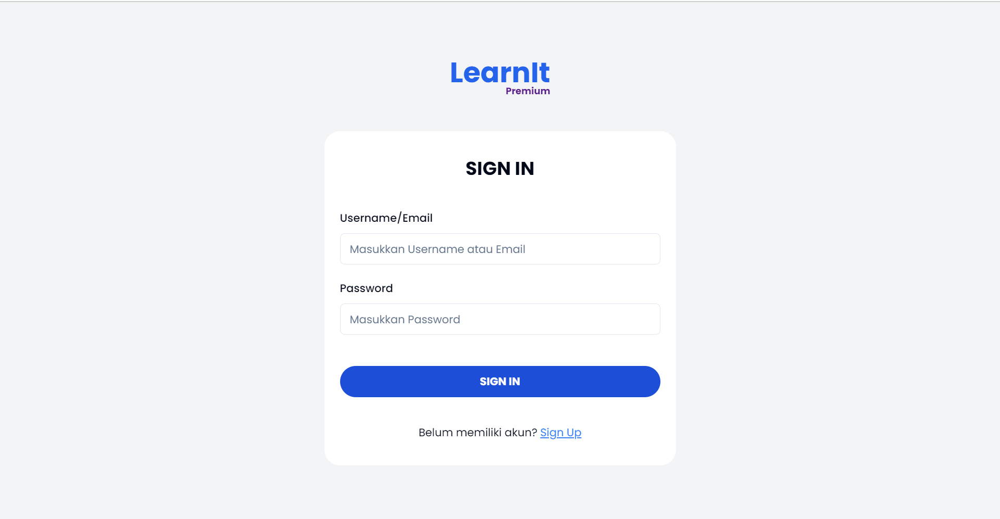
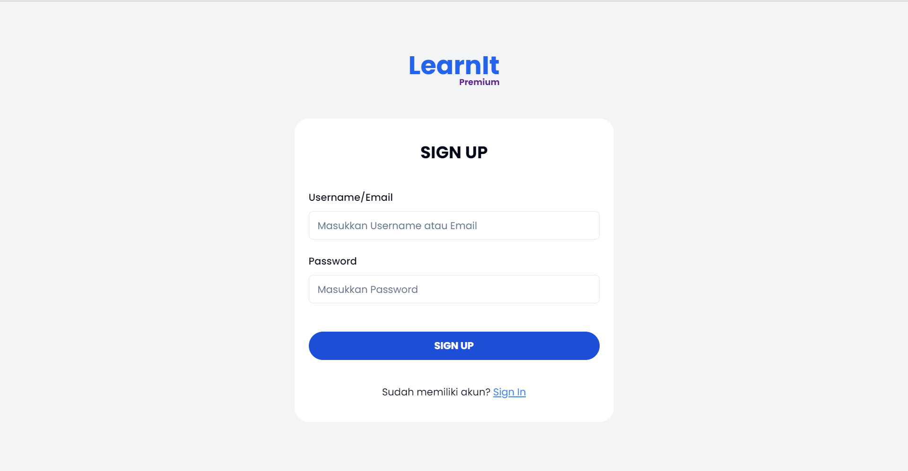
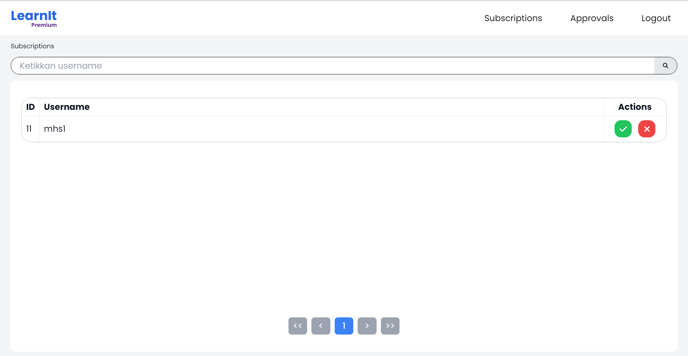
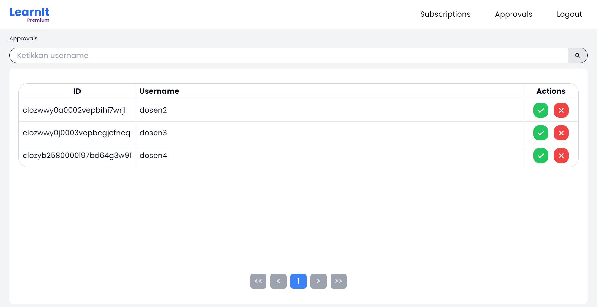
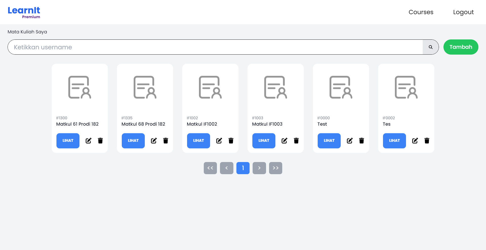
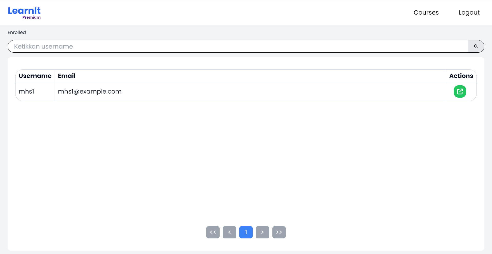
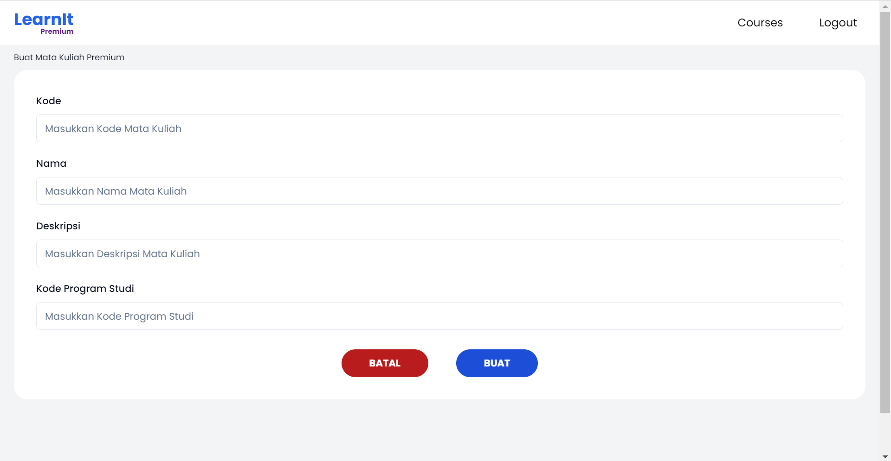
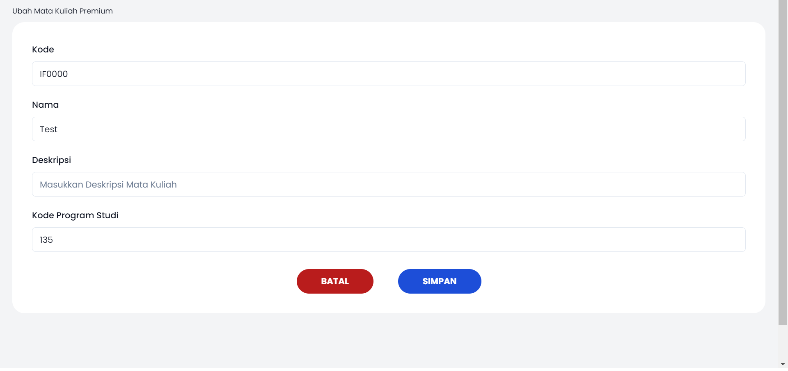

# Milestone 1 WBD Kelompok 9

## Deskripsi Aplikasi
Aplikasi LearnIt! adalah sebuah aplikasi LMS yang sisusun untuk memenuhi Tugas Milestone 2 IF3110 Pengembangan Aplikasi Berbasis Web. Aplikasi dapat diakses dengan 3 tipe pengguna: Admin, Pengajar, Pelajar. Admin memiliki kemampuan untuk mengubah semua data. Pengajar bisa membuat, membaca, mengubah, dan menghapus mata kuliah, modul, dan materi. Pelajar dapat mendaftar suatu mata kuliah dan membaca modul serta materi.   
Aplikasi ini memiliki mode premium dimana pelajar harus melakukan langganan terlebih dahulu dan di-approve oleh Admin. Pengajar yang ingin membuat mata kuliah premium harus melakukan apply yang harus di-approve oleh Admin. Kelebihan dari mata kuliah premium adalah adanya sertifikat penyelesaian yang dapat dikirimkan oleh pengajar mata kuliah berkait.   
SPA Client ini merupakan bagian frontend untuk pengurusan fitur berkaitan dengan premium untuk admin dan pengajar.

## Dibuat Oleh:
- [Miftahul Janna Awaliyah (10023212)](https://github.com/Mitahul03)
- [Moch. Sofyan Firdaus (13521083)](https://github.com/msfir)
- [Farhan Nabil Suryono (13521114)](https://github.com/Altair1618)

## Tech Stacks:
1. NodeJS 18
2. ReactTS

## Cara Instalasi
1. Clone _repository_ ini beserta repository lainnya dalam satu folder yang sama
2. Buatlah sebuah file `.env` yang bersesuaian dengan penggunaan (contoh file tersebut dapat dilihat pada `.env.example`).

## Cara Menjalankan Server
1. Jalankan perintah `docker compose up -d` pada folder repository config
2. Aplikasi berjalan pada `http://localhost:3000`.
3. Hentikan aplikasi dengan perintah `docker compose down` pada folder repository config.

## Tangkapan Layar Aplikasi

## Pembagian Tugas
### Setup
<table>
  <tbody>
    <tr>
      <td>Docker</td>
      <td>13521114</td>
    </tr>
    <tr>
      <td>Framework Pengerjaan</td>
      <td>13521114</td>
    </tr>
  </tbody>
</table>

### Halaman 
<table>
  <tbody>
    <tr>
      <td>Login</td>
      <td>13521114</td>
    </tr>
    <tr>
      <td>Register</td>
      <td>13521114</td>
    </tr>
    <tr>
      <td>Halaman Subscriptions</td>
      <td>13521083</td>
    </tr>
    <tr>
      <td>Halaman Approvals</td>
      <td>13521083</td>
    </tr>
    <tr>
      <td>Halaman List Mata Kuliah</td>
      <td>13521083</td>
    </tr>
    <tr>
      <td>Halaman Peserta Mata Kuliah</td>
      <td>13521083</td>
    </tr>
    <tr>
      <td>Halaman Buat Mata Kuliah</td>
      <td>13521114</td>
    </tr>
    <tr>
      <td>Halaman Ubah Mata Kuliah</td>
      <td>13521114</td>
    </tr>
  </tbody>
</table>
